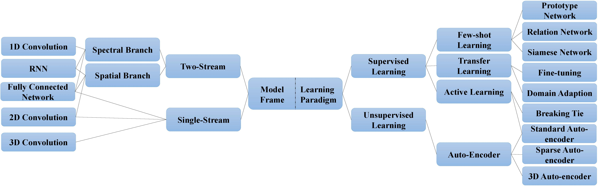

# A survey: Deep Learning for Hyperspectral Image Classification with Few Labeled Samples
## ABSTRACTION 
With the rapid development of deep learning technology and improvement of computing capability, deep learning has been widely used in the field of hyperspectral image (HSI) classification. In general, deep learning models often contain many trainable parameters and require a huge number of labeled samples to achieve optimal performance. However, with respect to HSI classification, a large number of labeled samples is difficult to be acquired due to the difficulty and time-consuming of manually labelling. Therefore, many research works focus on building a deep learning model for HSI classification with few labeled samples. In this article, we concentrate on this topic and provide a systematical review of relevant literatures. Specifically, the contributions of this paper is twofold. First, the research progress of related methods is categorized according to the learning paradigm, including transfer learning, active learning and few-shot learning. Second, a number of experiments with various state-of-the-art approaches has been carried out and the results are summarized to reveal the potential research directions. More importantly, it is worth to point out that although there is a huge gap between deep learning models (that usually needs sufficient labeled samples) and few labeled samples of HSI, the small sample set issue can be well characterized with the fusion of deep learning methods and related techniques, such as transfer learning and lightweight model. 

## Code
The source codes of models which we use is shown below.
* [SAE_LR](https://github.com/ShuGuoJ/SAE-LR.git)
* [S-DMM](https://github.com/ShuGuoJ/S-DMM.git)
* [SSDL](https://github.com/ShuGuoJ/SSDL.git)
* [3DCAE](https://github.com/ShuGuoJ/S-DMM.git)
* [TwoCNN](https://github.com/ShuGuoJ/TwoCnn.git)
* [3DVSCNN](https://github.com/ShuGuoJ/3DVSCNN.git)
* [SSLstm](https://github.com/ShuGuoJ/SSLstm.git)
* [CNN_HSI](https://github.com/ShuGuoJ/CNN-HSI.git)
